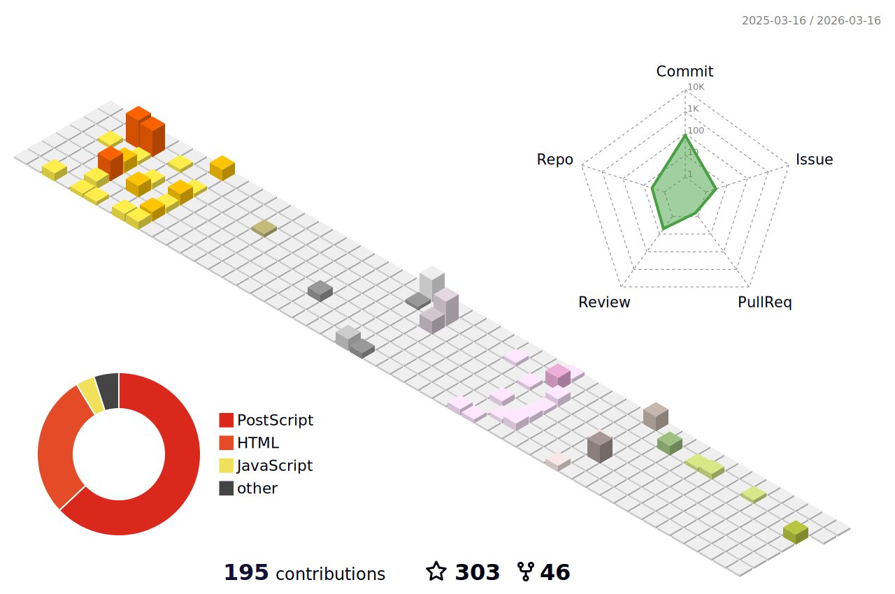

### Hi there 👋

<div align="center">
  <h1>
    You Are My  Visitors
  </h1>
  <!---->

  <a href="https://git.io/typing-svg"></a>

  
  
  
  
  
  
  </br>
  
  
  
  
  
  
  </br>
  
  
  
  
  </br>
  
  </br>
  <!---->
  
  </br>
</div>

<!--START_SECTION:waka-->


**🐱 My GitHub Data** 

> 📦 587.7 kB Used in GitHub's Storage 
 > 
> 🏆 100 Contributions in the Year 2024
 > 
> 🚫 Not Opted to Hire
 > 
> 📜 30 Public Repositories 
 > 
> 🔑 27 Private Repositories 
 > 
**I'm a Night 🦉** 

```text
🌞 Morning                245 commits         ███░░░░░░░░░░░░░░░░░░░░░░   13.80 % 
🌆 Daytime                455 commits         ██████░░░░░░░░░░░░░░░░░░░   25.62 % 
🌃 Evening                639 commits         █████████░░░░░░░░░░░░░░░░   35.98 % 
🌙 Night                  437 commits         ██████░░░░░░░░░░░░░░░░░░░   24.61 % 
```
📅 **I'm Most Productive on Monday** 

```text
Monday                   304 commits         ████░░░░░░░░░░░░░░░░░░░░░   17.12 % 
Tuesday                  276 commits         ████░░░░░░░░░░░░░░░░░░░░░   15.54 % 
Wednesday                255 commits         ████░░░░░░░░░░░░░░░░░░░░░   14.36 % 
Thursday                 193 commits         ███░░░░░░░░░░░░░░░░░░░░░░   10.87 % 
Friday                   250 commits         ████░░░░░░░░░░░░░░░░░░░░░   14.08 % 
Saturday                 211 commits         ███░░░░░░░░░░░░░░░░░░░░░░   11.88 % 
Sunday                   287 commits         ████░░░░░░░░░░░░░░░░░░░░░   16.16 % 
```


📊 **This Week I Spent My Time On** 

```text
🕑︎ Time Zone: Asia/Shanghai

💬 Programming Languages: 
C++                      15 hrs 28 mins      ██████████████████░░░░░░░   71.44 % 
Python                   4 hrs 16 mins       █████░░░░░░░░░░░░░░░░░░░░   19.71 % 
Dart                     45 mins             █░░░░░░░░░░░░░░░░░░░░░░░░   03.48 % 
YAML                     35 mins             █░░░░░░░░░░░░░░░░░░░░░░░░   02.72 % 
Markdown                 19 mins             ░░░░░░░░░░░░░░░░░░░░░░░░░   01.49 % 

🔥 Editors: 
VS Code                  21 hrs 39 mins      █████████████████████████   100.00 % 

🐱‍💻 Projects: 
rm_buff                  7 hrs 59 mins       █████████░░░░░░░░░░░░░░░░   36.91 % 
rm_auto_record           5 hrs 28 mins       ██████░░░░░░░░░░░░░░░░░░░   25.32 % 
bx                       1 hr 55 mins        ██░░░░░░░░░░░░░░░░░░░░░░░   08.87 % 
src                      1 hr 51 mins        ██░░░░░░░░░░░░░░░░░░░░░░░   08.56 % 
rm_serial_driver         1 hr 48 mins        ██░░░░░░░░░░░░░░░░░░░░░░░   08.38 % 

💻 Operating System: 
WSL                      18 hrs 51 mins      ██████████████████████░░░   87.11 % 
Windows                  2 hrs 47 mins       ███░░░░░░░░░░░░░░░░░░░░░░   12.89 % 
```

**I Mostly Code in Python** 

```text
Python                   18 repos            █████████░░░░░░░░░░░░░░░░   34.62 % 
C++                      11 repos            █████░░░░░░░░░░░░░░░░░░░░   21.15 % 
C                        3 repos             █░░░░░░░░░░░░░░░░░░░░░░░░   05.77 % 
Dart                     2 repos             █░░░░░░░░░░░░░░░░░░░░░░░░   03.85 % 
Java                     2 repos             █░░░░░░░░░░░░░░░░░░░░░░░░   03.85 % 
```


 Last Updated on 26/04/2024 13:13:37 UTC
<!--END_SECTION:waka-->

<div align="center">
  </br>
  <h2>
    Latest Blog Posts
  </h2>
</div>

<!-- BLOGPOSTS:START -->
- [通过 Docker 部署 DOMjudge](https://fater.top/record/domjudge-docker-config/)
- [升级WSL2系统并安装ROS2-Humble](https://fater.top/record/upgrade-wsl-system-install-ros2-humble/)
- [Ubuntu 20.04 构建并测试 AlphaPose](https://fater.top/usage/build-test-alphapose/)
- [简单使用 chatGPT API](https://fater.top/usage/use-chatgpt-api/)
- [无网卡设备利用树莓派wifi联网 | DHCP](https://fater.top/record/raspi-relay-wifi/)
<!-- BLOGPOSTS:END -->
