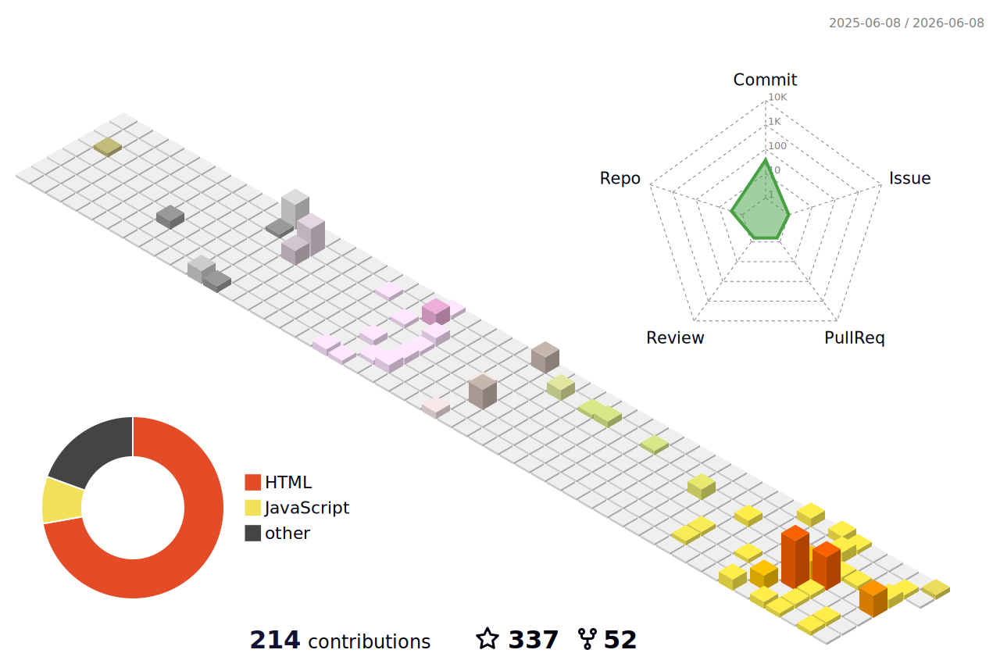

### Hi there 👋

👨‍🎓 [Profile](https://fateryu.github.io/) 📓 [Blog](https://fater.top/) 📽️ [Bilibili](https://space.bilibili.com/188667355)

<div align="center">
  <h1>
    You Are My  Visitors
  </h1>
  <!---->

  <a href="https://git.io/typing-svg"></a>

  
  
  
  
  
  
  </br>
  
  
  
  
  
  
  </br>
  
  
  
  
  </br>
  
  </br>
  <!---->
  
  </br>
</div>

<!--START_SECTION:waka-->


**🐱 My GitHub Data** 

> 📦 1.3 MB Used in GitHub's Storage 
 > 
> 🏆 9 Contributions in the Year 2026
 > 
> 🚫 Not Opted to Hire
 > 
> 📜 48 Public Repositories 
 > 
> 🔑 28 Private Repositories 
 > 
**I'm a Night 🦉** 

```text
🌞 Morning                233 commits         ████░░░░░░░░░░░░░░░░░░░░░   14.16 % 
🌆 Daytime                383 commits         ██████░░░░░░░░░░░░░░░░░░░   23.28 % 
🌃 Evening                595 commits         █████████░░░░░░░░░░░░░░░░   36.17 % 
🌙 Night                  434 commits         ███████░░░░░░░░░░░░░░░░░░   26.38 % 
```
📅 **I'm Most Productive on Monday** 

```text
Monday                   362 commits         ██████░░░░░░░░░░░░░░░░░░░   22.01 % 
Tuesday                  229 commits         ███░░░░░░░░░░░░░░░░░░░░░░   13.92 % 
Wednesday                223 commits         ███░░░░░░░░░░░░░░░░░░░░░░   13.56 % 
Thursday                 199 commits         ███░░░░░░░░░░░░░░░░░░░░░░   12.10 % 
Friday                   220 commits         ███░░░░░░░░░░░░░░░░░░░░░░   13.37 % 
Saturday                 194 commits         ███░░░░░░░░░░░░░░░░░░░░░░   11.79 % 
Sunday                   218 commits         ███░░░░░░░░░░░░░░░░░░░░░░   13.25 % 
```


📊 **This Week I Spent My Time On** 

```text
🕑︎ Time Zone: Asia/Shanghai

💬 Programming Languages: 
Python                   2 hrs 7 mins        █████████████████████░░░░   82.99 % 
Markdown                 16 mins             ███░░░░░░░░░░░░░░░░░░░░░░   10.72 % 
C                        6 mins              █░░░░░░░░░░░░░░░░░░░░░░░░   04.39 % 
Git Config               1 min               ░░░░░░░░░░░░░░░░░░░░░░░░░   01.00 % 
Text                     1 min               ░░░░░░░░░░░░░░░░░░░░░░░░░   00.85 % 

🔥 Editors: 
VS Code                  2 hrs 33 mins       █████████████████████████   100.00 % 

🐱‍💻 Projects: 
arm-control              50 mins             ████████░░░░░░░░░░░░░░░░░   32.77 % 
Unknown Project          41 mins             ███████░░░░░░░░░░░░░░░░░░   26.91 % 
DM-IMU-macOS-CLI         33 mins             █████░░░░░░░░░░░░░░░░░░░░   21.62 % 
openarm_isaac_lab        26 mins             ████░░░░░░░░░░░░░░░░░░░░░   16.95 % 
mc02-can3-imu-base       2 mins              ░░░░░░░░░░░░░░░░░░░░░░░░░   01.75 % 

💻 Operating System: 
Mac                      2 hrs 33 mins       █████████████████████████   100.00 % 
```

**I Mostly Code in Python** 

```text
Python                   25 repos            █████████░░░░░░░░░░░░░░░░   37.31 % 
C++                      16 repos            ██████░░░░░░░░░░░░░░░░░░░   23.88 % 
JavaScript               8 repos             ███░░░░░░░░░░░░░░░░░░░░░░   11.94 % 
HTML                     4 repos             █░░░░░░░░░░░░░░░░░░░░░░░░   05.97 % 
TeX                      2 repos             █░░░░░░░░░░░░░░░░░░░░░░░░   02.99 % 
```


 Last Updated on 27/03/2026 04:32:38 UTC
<!--END_SECTION:waka-->

<div align="center">
  </br>
  <h2>
    Latest Blog Posts
  </h2>
</div>

<!-- BLOGPOSTS:START -->
- [通过 Docker 部署 DOMjudge](https://fater.top/record/domjudge-docker-config/)
- [升级WSL2系统并安装ROS2-Humble](https://fater.top/record/upgrade-wsl-system-install-ros2-humble/)
- [Ubuntu 20.04 构建并测试 AlphaPose](https://fater.top/usage/build-test-alphapose/)
- [简单使用 chatGPT API](https://fater.top/usage/use-chatgpt-api/)
- [无网卡设备利用树莓派wifi联网 | DHCP](https://fater.top/record/raspi-relay-wifi/)
<!-- BLOGPOSTS:END -->
