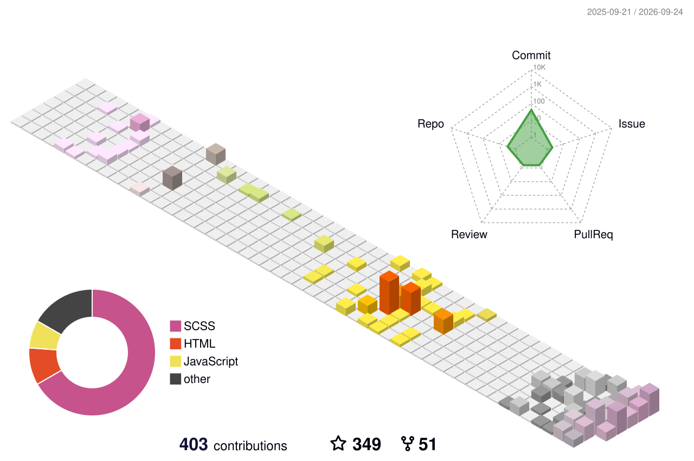

<h3>Hi there 👋</h3>

<p>
  👨‍🎓 <a href="https://fateryu.github.io/">Profile</a> |
<!--  📓 <a href="https://fater.top/">Blog</a> | -->
  📽️ <a href="https://space.bilibili.com/188667355">Bilibili</a>

  🎓 M.S. @ HNU 🎓 Dual B.S. @ SCNU & UoA<br/>
  🧠 Exploring Computer Vision, Robotics, Embodied AI, and World Models<br/>
  📚 Sharing projects, tools, and research along the way<br/>
  🌱 Might become the last generation to coding by hand, AI shock is coming!
</p>

<p>
  <a href="https://git.io/typing-svg">
    
  </a>
</p>

<div align="left">
  <strong>
    <span style="font-size: 32px;">
      You Are My
      
      Visitors
    </span>
    since 2026.04.01
  </strong>
</div>




<br clear="both" />

<!--START_SECTION:waka-->


**🐱 My GitHub Data** 

> 📦 1.5 MB Used in GitHub's Storage 
 > 
> 🏆 123 Contributions in the Year 2026
 > 
> 🚫 Not Opted to Hire
 > 
> 📜 49 Public Repositories 
 > 
> 🔑 35 Private Repositories 
 > 
**I'm a Night 🦉** 

```text
🌞 Morning                239 commits         ███░░░░░░░░░░░░░░░░░░░░░░   13.37 % 
🌆 Daytime                441 commits         ██████░░░░░░░░░░░░░░░░░░░   24.68 % 
🌃 Evening                654 commits         █████████░░░░░░░░░░░░░░░░   36.60 % 
🌙 Night                  453 commits         ██████░░░░░░░░░░░░░░░░░░░   25.35 % 
```


📊 **This Week I Spent My Time On** 

```text
🕑︎ Time Zone: Asia/Shanghai

🔥 Editors: 
VS Code                  51 mins             █████████████████████████   100.00 % 
```

🤖 **AI Coding This Week** 

```text
⏱ AI Coding Time: 28 mins (55.71%)

✍️ 0 lines written by AI, 0 lines written by hand (0% AI-written)

🔤 3,759,858 Input Tokens, 12,124 Output Tokens

💵 $14.74 Estimated AI Cost This Week

🧠 1 AI Sessions, 7 AI Prompts

GPT                      0 lines             ░░░░░░░░░░░░░░░░░░░░░░░░░   00.00 % 

🔎 AI Coding Insights:
🧑‍💻 Mostly Hands-On — 0% of written lines came from AI
📝 Concise Prompter — average 127 characters per prompt
🔁 Iterative Prompter — average 7 prompts per session
🚀 High AI Trust — 0% of changed lines were hand-edited
```

**I Mostly Code in Python** 

```text
Python                   26 repos            █████████░░░░░░░░░░░░░░░░   36.11 % 
C++                      15 repos            █████░░░░░░░░░░░░░░░░░░░░   20.83 % 
JavaScript               8 repos             ███░░░░░░░░░░░░░░░░░░░░░░   11.11 % 
TeX                      6 repos             ██░░░░░░░░░░░░░░░░░░░░░░░   08.33 % 
HTML                     4 repos             █░░░░░░░░░░░░░░░░░░░░░░░░   05.56 % 
```


 Last Updated on 03/08/2026 04:36:18 UTC
<!--END_SECTION:waka-->

## Star History

<a href="https://www.star-history.com/?repos=FaterYU%2FNEXT-SCNUThesis%2CFaterYU%2Frm_vision%2CFaterYU%2FOccSTeP&type=date&legend=bottom-right">
 <picture>
   <source media="(prefers-color-scheme: dark)" srcset="https://api.star-history.com/chart?repos=FaterYU/NEXT-SCNUThesis%2CFaterYU/rm_vision%2CFaterYU/OccSTeP&type=date&theme=dark&legend=top-left" />
   <source media="(prefers-color-scheme: light)" srcset="https://api.star-history.com/chart?repos=FaterYU/NEXT-SCNUThesis%2CFaterYU/rm_vision%2CFaterYU/OccSTeP&type=date&legend=top-left" />
   
 </picture>
</a>

<!--
<div align="center">
  </br>
  <h2>
    Latest Blog Posts
  </h2>
</div>
-->

<!-- BLOGPOSTS:START -->
<!-- BLOGPOSTS:END -->
