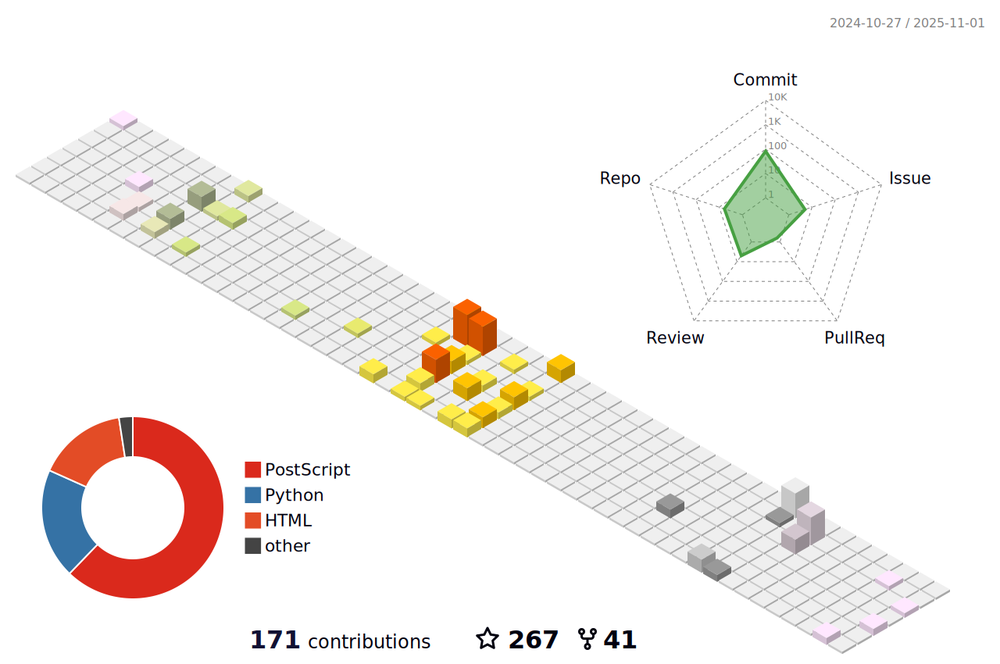

### Hi there 👋

<div align="center">
  <h1>
    You Are My  Visitors
  </h1>
  <!---->

  <a href="https://git.io/typing-svg"></a>

  
  
  
  
  
  
  </br>
  
  
  
  
  
  
  </br>
  
  
  
  
  </br>
  
  </br>
  <!---->
  
  </br>
</div>

<!--START_SECTION:waka-->


**🐱 My GitHub Data** 

> 📦 564.8 kB Used in GitHub's Storage 
 > 
> 🏆 95 Contributions in the Year 2024
 > 
> 🚫 Not Opted to Hire
 > 
> 📜 29 Public Repositories 
 > 
> 🔑 27 Private Repositories 
 > 
**I'm a Night 🦉** 

```text
🌞 Morning                244 commits         ███░░░░░░░░░░░░░░░░░░░░░░   13.79 % 
🌆 Daytime                454 commits         ██████░░░░░░░░░░░░░░░░░░░   25.65 % 
🌃 Evening                636 commits         █████████░░░░░░░░░░░░░░░░   35.93 % 
🌙 Night                  436 commits         ██████░░░░░░░░░░░░░░░░░░░   24.63 % 
```
📅 **I'm Most Productive on Monday** 

```text
Monday                   304 commits         ████░░░░░░░░░░░░░░░░░░░░░   17.18 % 
Tuesday                  276 commits         ████░░░░░░░░░░░░░░░░░░░░░   15.59 % 
Wednesday                254 commits         ████░░░░░░░░░░░░░░░░░░░░░   14.35 % 
Thursday                 191 commits         ███░░░░░░░░░░░░░░░░░░░░░░   10.79 % 
Friday                   247 commits         ███░░░░░░░░░░░░░░░░░░░░░░   13.95 % 
Saturday                 211 commits         ███░░░░░░░░░░░░░░░░░░░░░░   11.92 % 
Sunday                   287 commits         ████░░░░░░░░░░░░░░░░░░░░░   16.21 % 
```


📊 **This Week I Spent My Time On** 

```text
🕑︎ Time Zone: Asia/Shanghai

💬 Programming Languages: 
C++                      17 hrs 24 mins      ██████████████████░░░░░░░   72.41 % 
Python                   4 hrs 44 mins       █████░░░░░░░░░░░░░░░░░░░░   19.69 % 
Markdown                 52 mins             █░░░░░░░░░░░░░░░░░░░░░░░░   03.66 % 
YAML                     28 mins             ░░░░░░░░░░░░░░░░░░░░░░░░░   01.95 % 
CMake                    16 mins             ░░░░░░░░░░░░░░░░░░░░░░░░░   01.12 % 

🔥 Editors: 
VS Code                  24 hrs 3 mins       █████████████████████████   100.00 % 

🐱‍💻 Projects: 
rm_buff                  9 hrs 25 mins       ██████████░░░░░░░░░░░░░░░   39.15 % 
src                      8 hrs 25 mins       █████████░░░░░░░░░░░░░░░░   35.04 % 
bx                       1 hr 55 mins        ██░░░░░░░░░░░░░░░░░░░░░░░   07.99 % 
rm_serial_driver         1 hr 54 mins        ██░░░░░░░░░░░░░░░░░░░░░░░   07.97 % 
rm_auto_aim              40 mins             █░░░░░░░░░░░░░░░░░░░░░░░░   02.83 % 

💻 Operating System: 
WSL                      20 hrs 11 mins      █████████████████████░░░░   83.97 % 
Windows                  3 hrs 51 mins       ████░░░░░░░░░░░░░░░░░░░░░   16.03 % 
```

**I Mostly Code in Python** 

```text
Python                   18 repos            █████████░░░░░░░░░░░░░░░░   34.62 % 
C++                      11 repos            █████░░░░░░░░░░░░░░░░░░░░   21.15 % 
C                        3 repos             █░░░░░░░░░░░░░░░░░░░░░░░░   05.77 % 
Dart                     2 repos             █░░░░░░░░░░░░░░░░░░░░░░░░   03.85 % 
Java                     2 repos             █░░░░░░░░░░░░░░░░░░░░░░░░   03.85 % 
```


 Last Updated on 23/04/2024 06:17:06 UTC
<!--END_SECTION:waka-->

<div align="center">
  </br>
  <h2>
    Latest Blog Posts
  </h2>
</div>

<!-- BLOGPOSTS:START -->
- [通过 Docker 部署 DOMjudge](https://fater.top/record/domjudge-docker-config/)
- [升级WSL2系统并安装ROS2-Humble](https://fater.top/record/upgrade-wsl-system-install-ros2-humble/)
- [Ubuntu 20.04 构建并测试 AlphaPose](https://fater.top/usage/build-test-alphapose/)
- [简单使用 chatGPT API](https://fater.top/usage/use-chatgpt-api/)
- [无网卡设备利用树莓派wifi联网 | DHCP](https://fater.top/record/raspi-relay-wifi/)
<!-- BLOGPOSTS:END -->
